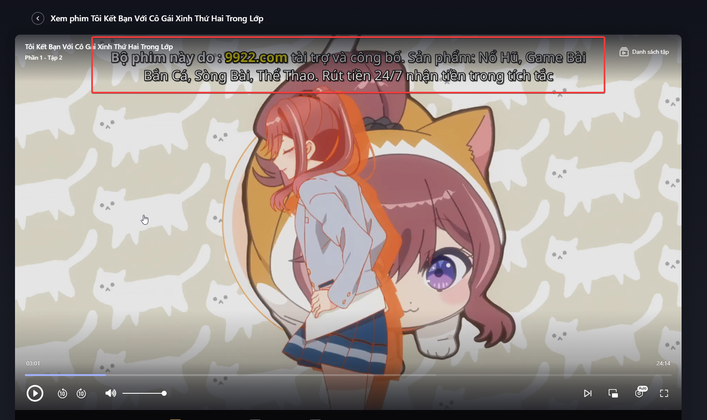

# AdsSkipperRoPhim

Extension Chrome giúp giảm quảng cáo khi xem phim trên các trang RoPhim / CobePhim và các domain tương tự.

Extension này xử lý 2 kiểu quảng cáo thường gặp:

## Ví Dụ Quảng Cáo

### 1. Quảng cáo chữ đè lên video



Một số playlist video chèn đoạn quảng cáo khiến chữ quảng cáo hiện đè lên phim. Extension sẽ sửa playlist để bỏ phần chèn này nếu nhận diện được.

### 2. Quảng cáo chèn giữa phim


Một số quảng cáo được chèn như các đoạn video ngắn nằm giữa phim. Extension sẽ xóa các đoạn quảng cáo đó khỏi playlist trước khi player phát.

## Cách Cài Đặt

1. Mở Chrome.
2. Vào:

```text
chrome://extensions
```

3. Bật `Developer mode`.
4. Bấm `Load unpacked`.
5. Chọn thư mục:

```text
C:\Users\caoth\Code\WebstormProjects\AddsSkipperRoPhim
```

6. Mở lại trang phim.

Nếu vừa cập nhật extension, hãy bấm nút reload ở `chrome://extensions`, sau đó reload lại trang phim.

## Cách Dùng

Mở popup của extension:

- `Skip ads`: bật/tắt extension.
- `Total removed`: số đoạn quảng cáo đã xóa.
- `Last status`: trạng thái xử lý gần nhất.
- `Last playlist`: playlist video gần nhất extension đã xử lý.
- `Debug logging`: chỉ bật khi cần kiểm tra lỗi.

Bình thường chỉ cần bật `Skip ads` rồi xem phim.

## Khi Website Đổi Domain

Nếu trang phim đổi domain, thêm domain mới vào ô `Enabled website hosts`.

Ví dụ nếu đang xem ở `cobephim.xyz`, có thể để:

```text
cobephim.*
*.cobephim.*
```

Mỗi dòng là một domain pattern. Sau khi sửa xong, bấm `Save hosts` rồi reload lại trang phim.

Lưu ý: domain của file video có thể khác domain trang phim, ví dụ:

```text
https://v7.kkphimplayer7.com/.../hls/index.m3u8
```

Điều này bình thường. Chỉ cần domain trang đang xem phim có trong `Enabled website hosts`.

## Nếu Không Hoạt Động

Thử theo thứ tự:

1. Kiểm tra `Skip ads` đã bật chưa.
2. Kiểm tra domain trang phim đã có trong `Enabled website hosts` chưa.
3. Reload lại trang phim.
4. Vào `chrome://extensions` reload extension, rồi reload lại trang phim lần nữa.

Nếu vẫn chưa được:

1. Bật `Debug logging`.
2. Mở DevTools bằng `F12`.
3. Vào tab `Console`.
4. Tìm log:

```text
[AdsSkipperRoPhim]
```

Ý nghĩa log:

- `Injected on ...`: extension đã chạy.
- `Removed X segment(s)`: extension đã xóa quảng cáo.
- `no-match`: extension thấy playlist nhưng chưa nhận diện được kiểu quảng cáo đó.
- `Host not enabled`: domain hiện tại chưa có trong `Enabled website hosts`.

## Ghi Chú

Extension này không tải phim, không sửa file phim thật, và không can thiệp vào server. Nó chỉ sửa playlist video trong trình duyệt để bỏ các đoạn quảng cáo đã nhận diện được.
